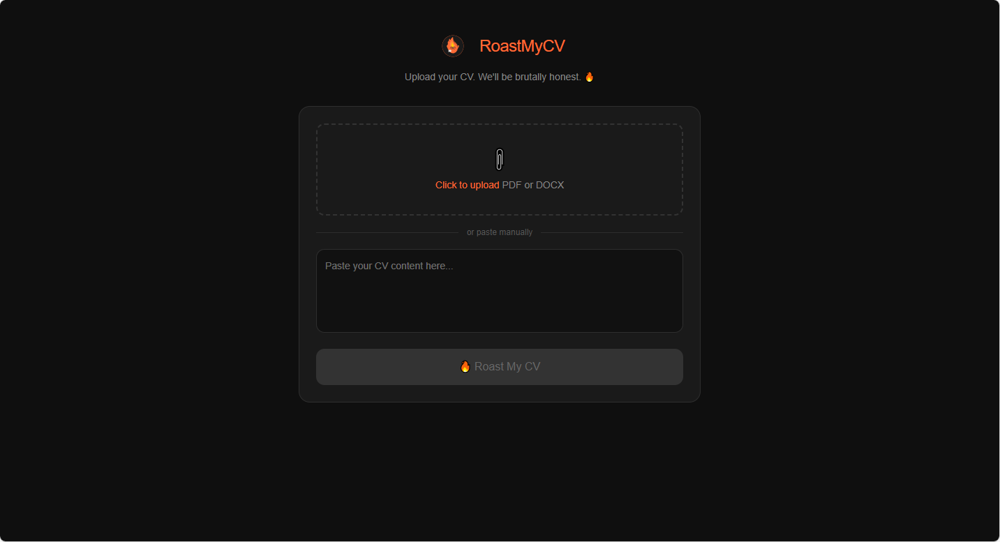
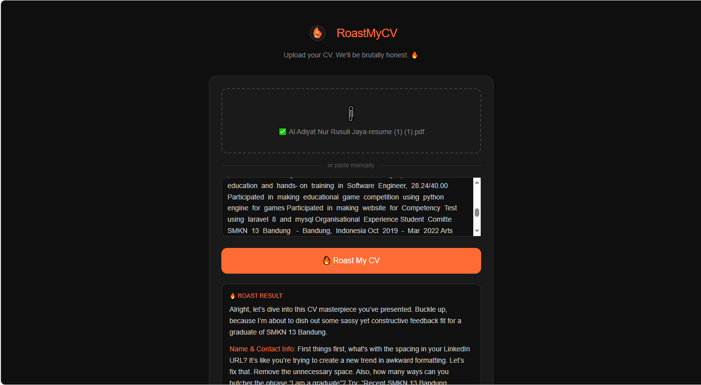

# 🔥 RoastMyCV

<p align="center">
  <i>Upload your CV. We'll be brutally honest.</i>
</p>

<p align="center">
  <a href="https://nextjs.org">
    
  </a>
  <a href="https://github.com">
    
  </a>
</p>

---

## ✨ Features

- **📎 File Upload** — Upload PDF or DOCX files, we'll extract the text automatically
- **✍️ Manual Input** — Paste your CV text directly if you prefer
- **🔥 Brutal Feedback** — Get honest, no-holds-barred feedback on your CV
- **🎨 Modern UI** — Clean dark theme with orange accents

---

## 🚀 Getting Started

### Prerequisites

- Node.js 18+
- npm / yarn / pnpm / bun

### Installation

```bash
# Clone the repository
git clone <your-repo-url>
cd roast-my-cv

# Install dependencies
npm install
# or
yarn install
# or
pnpm install
```

### Run Development Server

```bash
npm run dev
```

Open [http://localhost:3000](http://localhost:3000) in your browser.

---

## 📖 Usage

1. **Upload CV** — Click the upload zone to select a PDF or DOCX file, or paste your CV text directly
2. **Click Roast** — Hit the "Roast My CV" button
3. **Get Roasted** — Receive brutally honest feedback on your CV! 🔥

---

## 🛠️ API Endpoints

| Endpoint | Method | Description |
|----------|--------|-------------|
| `/api/extract` | POST | Extract text from PDF/DOCX files |
| `/api/roast` | POST | Generate roast feedback from CV text |

### API Request Examples

**Extract:**
```bash
curl -X POST http://localhost:3000/api/extract \
  -F "file=@cv.pdf"
```

**Roast:**
```bash
curl -X POST http://localhost:3000/api/roast \
  -H "Content-Type: application/json" \
  -d '{"cvText": "Your CV content here..."}'
```

---

## 📸 Screenshots

<!-- Add your screenshots below using this format: -->
<!--  -->

| Main Interface | Roast Result |
|----------------|--------------|
|  |  |

---

## 📁 Project Structure

```
roast-my-cv/
├── app/
│   ├── api/
│   │   ├── extract/       # File text extraction API
│   │   └── roast/         # CV roast generation API
│   ├── components/        # React components
│   ├── globals.css        # Global styles
│   ├── layout.js          # Root layout
│   └── page.js            # Main page
├── public/                # Static assets
├── package.json           # Dependencies
└── README.md              # This file
```

---

## 🤝 Contributing

1. Fork the repository
2. Create your feature branch (`git checkout -b feature/amazing-feature`)
3. Commit your changes (`git commit -m 'Add some amazing feature'`)
4. Push to the branch (`git push origin feature/amazing-feature`)
5. Open a Pull Request

---

## 📄 License

This project is licensed under the MIT License.

---

<p align="center">
  Made with 🔥 and brutal honesty
</p>

## Getting Started

First, run the development server:

```bash
npm run dev
# or
yarn dev
# or
pnpm dev
# or
bun dev
```

Open [http://localhost:3000](http://localhost:3000) with your browser to see the result.

You can start editing the page by modifying `app/page.js`. The page auto-updates as you edit the file.

This project uses [`next/font`](https://nextjs.org/docs/app/building-your-application/optimizing/fonts) to automatically optimize and load [Geist](https://vercel.com/font), a new font family for Vercel.

## Learn More

To learn more about Next.js, take a look at the following resources:

- [Next.js Documentation](https://nextjs.org/docs) - learn about Next.js features and API.
- [Learn Next.js](https://nextjs.org/learn) - an interactive Next.js tutorial.

You can check out [the Next.js GitHub repository](https://github.com/vercel/next.js) - your feedback and contributions are welcome!

## Deploy on Vercel

The easiest way to deploy your Next.js app is to use the [Vercel Platform](https://vercel.com/new?utm_medium=default-template&filter=next.js&utm_source=create-next-app&utm_campaign=create-next-app-readme) from the creators of Next.js.

Check out our [Next.js deployment documentation](https://nextjs.org/docs/app/building-your-application/deploying) for more details.
